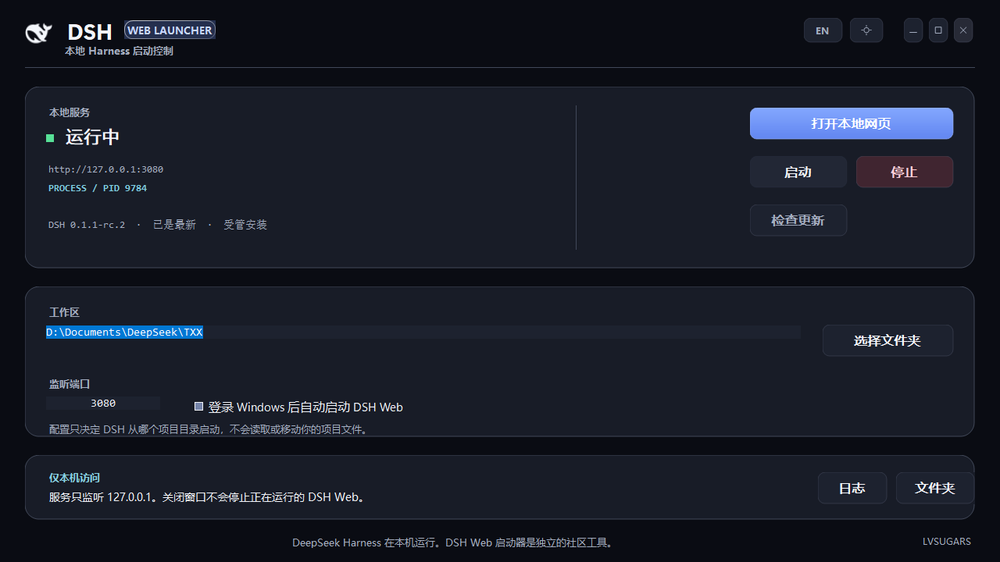
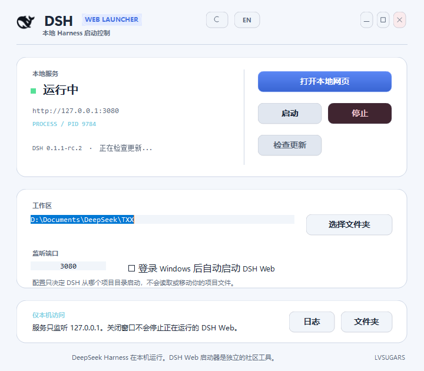

# DSH Web Launcher

**English** | [简体中文](README.md)

A lightweight Windows desktop launcher for the official DeepSeek Harness (DSH) Web CLI. It helps users install, start, stop, inspect, and update DSH Web without manually maintaining a Node.js setup or terminal commands. Created and maintained by [LVSUGARS](https://github.com/LVSUGARS).

> This is an independent community project. It is not affiliated with, endorsed by, or maintained by DeepSeek or the DSH team. It manages the official `@deepseek-ai/dsh` CLI; it is not a replacement for DSH itself.





## Highlights

- Installs a checksum-verified portable Node.js runtime and the official `@deepseek-ai/dsh` package on explicit user action.
- Starts DSH Web on `127.0.0.1`, opens the local UI, and exposes the workspace and port settings.
- Shows health, URL, listener PID, installed version, and npm latest-version status.
- Updates only manager-owned DSH runtimes. Existing global/PATH installations are detected but never modified.
- Shows real update stages for preparation, installation, validation, switching, and restart. During npm installation it shows an active indicator and elapsed time rather than inventing a byte percentage.
- Stops a service only after validating the PID, process start time, CLI path, and command line.
- Keeps `%USERPROFILE%\.dsh`, credentials, conversations, and selected workspaces outside the application's install and removal paths.
- Uses a compact layout for `4:3` windows and a wider workspace layout for `16:9`, `16:10`, and fullscreen windows.
- Includes persistent light/dark themes, bilingual UI, and vector window controls in the standard minimize, maximize/restore, close order.

## Download and use

Download the latest `Setup EXE` or portable ZIP from [Releases](../../releases/latest). Installation is per-user and does not require administrator privileges.

1. Open the launcher.
2. Select **Install official DSH** if no CLI is detected.
3. Choose a workspace and port.
4. Select **Start**, then **Open web page**.

The first DSH installation needs an internet connection, generally takes 5–20 minutes, and uses roughly 350 MB of disk space. The binaries are currently unsigned, so Windows SmartScreen can show an unknown-publisher warning. Download only from this repository's Releases page.

## Update behavior

The launcher checks npm's official `latest` metadata for `@deepseek-ai/dsh` asynchronously. A managed update checks the official version again before doing any work, so an already-current installation is never reinstalled. A newer runtime is installed and validated before the old one is replaced. If updating fails, the previous runtime is preserved and the original web service is restarted.

The progress bar represents those actual stages rather than download bytes. The installation stage shows elapsed time while npm processes roughly 450 dependencies and native modules; a first update can take 15–30 minutes. Use **Logs** for detailed output.

External npm, PATH, or WinGet installations are always read-only from this application.

## Data boundaries

| Data | Location / behavior |
| --- | --- |
| Launcher settings, state, logs | `%LOCALAPPDATA%\DSHWebManager` |
| Program files | `%LOCALAPPDATA%\Programs\DSH Web Launcher` |
| Managed Node.js and DSH runtime | `%LOCALAPPDATA%\DSHWebManager\runtime` |
| DSH sessions and credentials | `%USERPROFILE%\.dsh`, never read, bundled, or removed by this project |
| Workspace folders | Used only as the DSH working directory and never deleted on uninstall |

## Build from source

Requirements: Windows, the .NET Framework 4.8 C# compiler, and PowerShell. No NuGet packages are needed.

```powershell
git clone https://github.com/LVSUGARS/dsh-web-launcher.git
cd dsh-web-launcher
powershell -NoLogo -NoProfile -ExecutionPolicy Bypass -File .\Build.ps1
```

The setup EXE and portable ZIP are generated in `release/`.

## Contributing

Issues and pull requests are welcome. Never commit `.dsh`, workspaces, logs, tokens, or other personal data.
