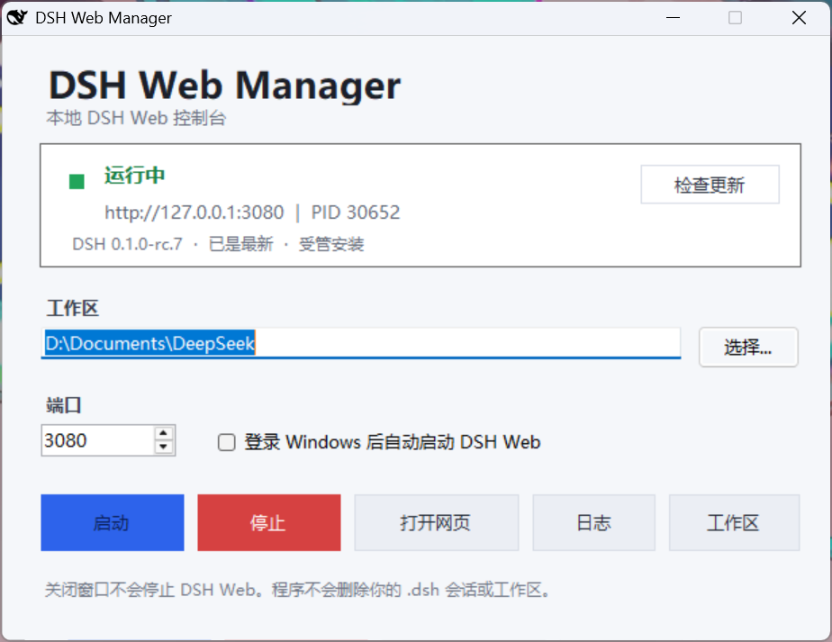

# DSH Web Manager

[English](README.en.md) | **简体中文**

面向 Windows 的 DSH Web 本地控制台。它把官方 `@deepseek-ai/dsh` CLI 的安装、启动、停止、更新检测和工作区配置收进一个轻量桌面窗口，适合不想手动敲命令或维护 Node.js 环境的用户。

> 非官方独立项目，与 DeepSeek 或 DSH 官方团队不存在隶属或背书关系。本项目不会替代 DSH；它只调用和管理用户自行选择安装的官方 CLI。



## 它解决什么问题

DSH Web 本身依赖 Node.js、CLI 安装、工作区路径和本地端口。对 Windows 用户来说，这几个步骤往往散落在终端、浏览器和任务管理器里。DSH Web Manager 将日常操作集中为：选择工作区、点击启动、打开网页；需要时还可以查看日志、关闭受管进程或更新受管 DSH。

## 功能

- **一键安装官方 DSH**：缺少 CLI 时，按需下载 Node.js，校验官方 SHA-256，再通过 npm 安装 `@deepseek-ai/dsh`。
- **本地 Web 控制**：启动后仅监听 `127.0.0.1`，可直接打开 Web 控制台；支持自定义端口与工作区。
- **运行状态可见**：显示健康状态、访问地址、监听 PID 和当前 DSH 版本。
- **更新检测**：异步查询 npm 官方 `latest` 版本，不阻塞 DSH Web 启动。
- **受管运行时一键更新**：由本工具安装的 DSH 可原子更新；更新失败会保留旧版本并恢复原 Web 服务。
- **外部安装只读**：检测到 PATH 或全局 npm 中已有 DSH 时，可以使用并显示版本，但不会擅自更新或删除。
- **安全停止**：只有 PID、启动时间、CLI 路径和命令行均与本工具记录一致时才会停止进程，避免误杀其他 Node 服务。
- **登录后启动**：可选创建当前用户的 Windows 启动项。

## 下载与安装

请前往 [Releases](../../releases/latest) 下载最新版：

- `DSH-Web-Manager-Setup-*.exe`：推荐。当前 Windows 用户安装，不需要管理员权限，会创建桌面与开始菜单快捷方式。
- `DSH-Web-Manager-*.zip`：便携包。解压后运行 `Install.cmd`，或直接使用其中的程序文件。

首次点击“安装官方 DSH”需要联网，通常需要 5–20 分钟，并约占用 350 MB 磁盘空间。安装器未进行代码签名，Windows SmartScreen 可能显示未知发布者提示；请仅从本仓库的 Release 页面下载。

## 快速开始

1. 打开 `DSH Web Manager`。
2. 若尚未安装 DSH，点击“安装官方 DSH”并等待完成。
3. 选择一个工作区目录，保持端口 `3080`，或按需修改。
4. 点击“启动”，状态变为“运行中”后点击“打开网页”。
5. 关闭管理器窗口不会停止 DSH Web；需要结束服务时，请点击“停止”。

## 更新规则

“检查更新”会读取 npm 官方注册表中 `@deepseek-ai/dsh` 的 `latest` 版本：

- **受管安装**：有新版本时显示“更新 DSH”。新版本会先安装到临时目录，校验完成后才替换旧版本。
- **外部安装**：仅显示版本状态。管理器不会修改通过 npm、WinGet 或其他方式安装的 DSH。
- **网络失败**：只影响版本状态显示，不影响已经运行的 DSH Web。

## 数据与安全边界

| 内容 | 位置 / 行为 |
| --- | --- |
| 管理器配置、状态、日志 | `%LOCALAPPDATA%\DSHWebManager` |
| 管理器程序文件 | `%LOCALAPPDATA%\Programs\DSH Web Manager` |
| 受管 Node.js 与 DSH 运行时 | `%LOCALAPPDATA%\DSHWebManager\runtime` |
| DSH 会话、账号和凭据 | `%USERPROFILE%\.dsh`，本工具不读取、不打包、不删除 |
| 选择的工作区 | 仅作为启动目录使用，卸载时不会删除 |

管理器只把 Web 服务绑定到 `127.0.0.1`。卸载会移除程序、快捷方式和受管运行时；默认保留配置、日志、`.dsh` 数据和工作区。

## 从源码构建

环境要求：Windows、.NET Framework 4.8 的 C# 编译器，以及 PowerShell。无需安装 NuGet 包。

```powershell
git clone https://github.com/LVSUGARS/dsh-web-manager.git
cd dsh-web-manager
powershell -NoLogo -NoProfile -ExecutionPolicy Bypass -File .\Build.ps1
```

构建结果位于 `release/`：安装器 EXE 与便携 ZIP 各一份。图标取自本地已安装官方 DSH Web 的 `favicon.svg` 并转换为 Windows 图标。

## 项目结构

```text
src/        WinForms 管理器与自解压安装器源码
installer/  每用户安装、卸载、受管运行时安装脚本
assets/     图标与 README 截图
specs/      需求、设计与实施清单
Build.ps1   本地构建脚本
```

## 常见问题

**端口被占用怎么办？** 选择一个未使用的端口后再启动。管理器会识别未知监听进程，并拒绝停止它。

**关闭窗口后网页还能打开吗？** 能。管理器关闭不等于 DSH Web 停止；请用“停止”结束由管理器验证过的服务。

**为什么外部安装没有“更新 DSH”按钮？** 这是刻意的安全边界。只有本工具自己维护的运行时才允许一键更新。

## 贡献与说明

欢迎提交 Issue 和 Pull Request。请勿提交 `.dsh`、工作区、日志、账号令牌或其他个人数据。

`DSH Web Manager` 是一个社区工具；DeepSeek Harness、`@deepseek-ai/dsh` 及其相关标识归各自权利人所有。
